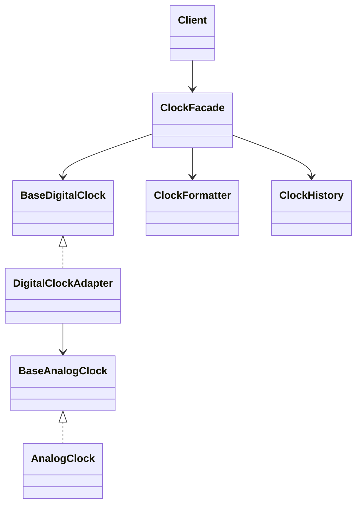

# Диаграмма

```mermaid
classDiagram
    Client --> ClockFacade
    ClockFacade --> BaseDigitalClock
    ClockFacade --> ClockFormatter
    ClockFacade --> ClockHistory
    BaseDigitalClock <|.. DigitalClockAdapter
    DigitalClockAdapter --> BaseAnalogClock
    BaseAnalogClock <|.. AnalogClock
```

`Клиент → ClockFacade → DigitalClockAdapter → AnalogClock`

Также фасад использует `ClockFormatter` и `ClockHistory`.
